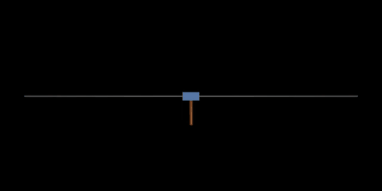
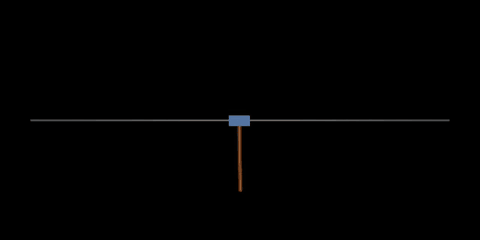
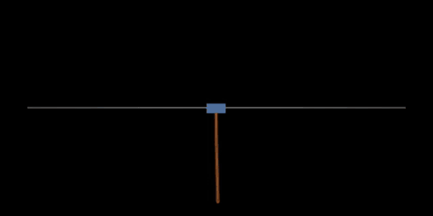

# pendulum-swingup

[](https://www.python.org/downloads/)
[](https://pytorch.org/)
[](https://mujoco.org/)
[](LICENSE)

PPO learns to swing up and balance one, two or three pendulum links on a cart. Each
policy is trained from scratch on a laptop CPU in under half an hour.

| 1 link | 2 links | 3 links |
| :-: | :-: | :-: |
|  |  |  |

## Results

Each policy is tested from 50 hanging starts. A start counts if every link stays within
10° of upright for the last 5 of 15 seconds. A seed solves the task if it holds at
least 45 of the 50.

| Links | Training steps | Time per seed | Seeds that solve it |
| --- | --- | --- | --- |
| 1 | 2M | 3 min | 4 of 4 |
| 2 | 8M | 10 min | 4 of 4 |
| 3 | 20M | 28 min | 2 of 4 |

Times are on an M2 Max with four seeds training at once, two cores each.

Three links is not reliable yet. One failing seed never learns to swing up. The other
learns it at about 10M steps and then loses it.

## Run

```bash
pip install -e .
python train.py --links 3 --seed 0
python evaluate.py runs/links_3/seed_0
```

Training writes the policy, a progress plot and a video to `runs/links_3/seed_0/`.

## How it works

The simulation is MuJoCo: a 0.5 kg cart on a ±2.4 m rail, links of 0.4 m and 0.1 kg,
and a motor limited to ±10 N at 100 Hz. `mujoco.rollout` steps 32 cart-pendulums at
once on two threads.

The policy sees the cart's position and velocity, and for each link the cosine and
sine of its angle, its angular velocity and how much of its rotation budget is left.

The reward is always between 0 and 1:

    reward = 0.05 × height + 0.95 / (1 + error)

The link furthest from upright decides both terms. Its height is 0 hanging and 1
upright. The error grows with its angle (scale 10°), the fastest link's speed
(0.5 rad/s), the cart's speed (0.5 m/s) and the cart's distance from the centre
(1.5 m). Height alone is worth at most 0.05; the rest requires being upright, still
and centred.

An episode ends in one of three ways:

- The cart reaches 2.3 m. This costs 1, because hanging earns almost nothing and
  hitting the rail would otherwise be free.
- A link has rotated 4π in total, counting every swing back and forth. Without this
  limit, spinning the links is an easy way to collect height reward.
- 15 seconds pass. This only cuts the episode short: PPO bootstraps from the value of
  the last state, as if the episode went on.

Three in four episodes start hanging. One in four starts within 2° of upright, so the
policy practises balancing before it can swing up.

PPO follows CleanRL: separate 128 × 128 tanh networks for policy and value,
32 environments × 256 steps per update, minibatches of 512 for 10 epochs, γ = 0.999,
GAE λ = 0.98, entropy 0.01, and a learning rate of 3e-4 that decays linearly to zero.

## Files

- `model.py` builds the MuJoCo model.
- `reward.py` computes the reward.
- `environment.py` steps many pendulums at once.
- `ppo.py` is PPO.
- `train.py` trains one seed.
- `evaluate.py` tests a policy and records a video.

MIT license.
